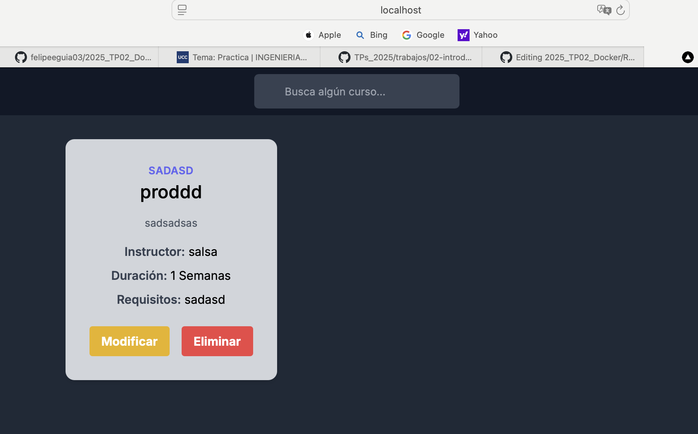
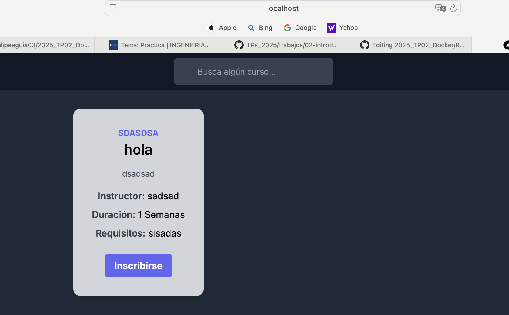
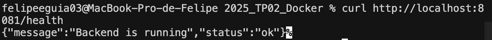
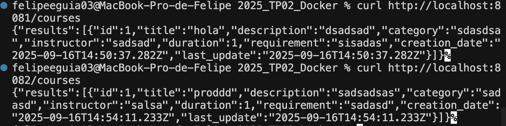
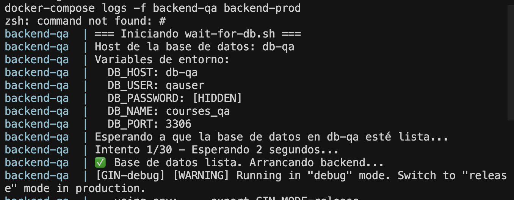
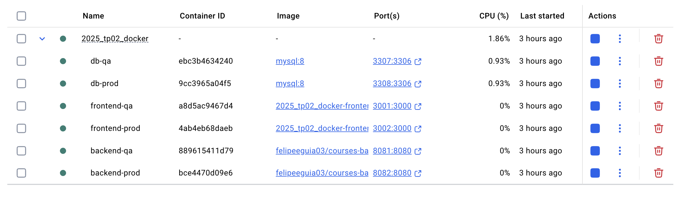
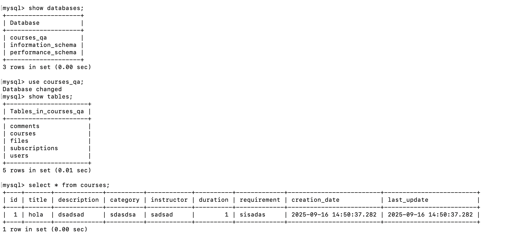
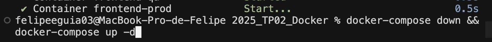
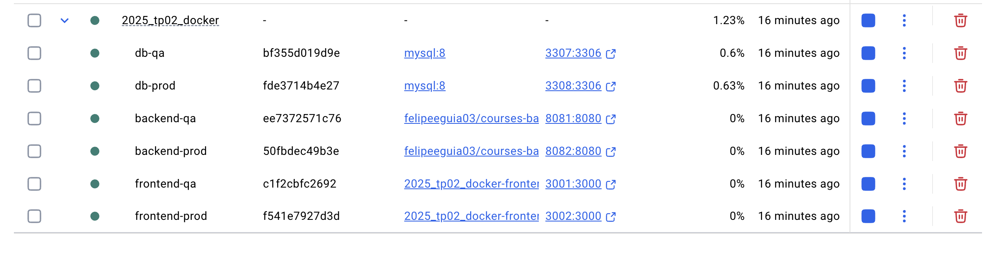
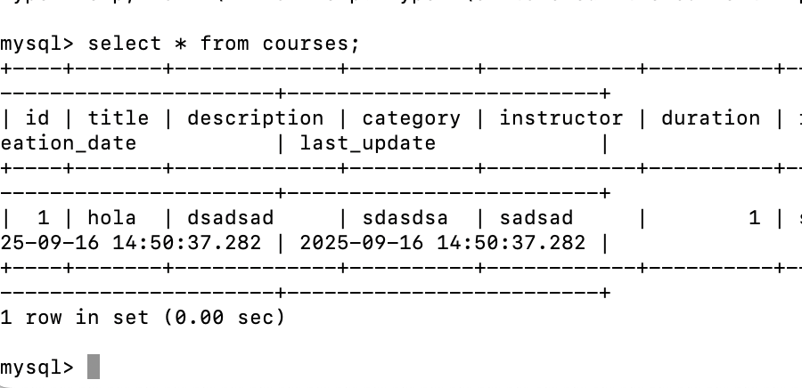

# Trabajo Práctico N°2 - Introducción a Docker

## 1. Elección de la aplicación

Decidimos usar un proyecto pasado de la facultad, originalmente desarrollado por Conrado Verzini.  
El repositorio original se encuentra en:  
[https://github.com/conradoverzini/2025_TP02_Docker](https://github.com/conradoverzini/2025_TP02_Docker)

Elegimos esta aplicación porque ya tiene una base sólida de código, lo que nos permitió enfocarnos en aprender Docker y la containerización en lugar de empezar un proyecto desde cero.  
Además, mantener el historial de commits es útil para ver la evolución del proyecto.

Para cumplir con la consigna de tener un repositorio propio, realicé un FORK del repositorio original.  
Mi copia del repositorio está en:  
[https://github.com/felipeeguia03/2025_TP02_Docker](https://github.com/felipeeguia03/2025_TP02_Docker)

Después del fork, actualicé el remote en mi repositorio local para apuntar a mi fork:

git remote set-url origin https://github.com/felipeeguia03/2025_TP02_Docker.git

## 2. Construir una imagen personalizada

##2.1. Separación Frontend / Backend
Decidimos crear dos Dockerfiles, uno para el frontend (Next.js / React) y otro para el backend (Go), siguiendo las buenas prácticas de Docker:
Separación de responsabilidades: cada contenedor hace una sola cosa.
Escalabilidad: permite levantar varios contenedores de backend sin afectar el frontend.
Mantenimiento: facilita actualizar una parte sin afectar la otra.
#2.2 Elección de imágenes base
Frontend: node:18-alpine
Backend: golang:1.22-alpine (build) + alpine:latest (runtime)
Justificación de Alpine:
✅ Ligera (~5 MB frente a ~100 MB de Ubuntu) → descarga y arranque rápido.
✅ Menor superficie de ataque → más segura.
✅ Eficiente → consume menos recursos de memoria y CPU.
❌ Desventaja: trae menos herramientas por defecto (apk vs apt), pero suficiente para nuestro proyecto.
#2.3 Multi-stage build
Se utilizó multi-stage build en ambos Dockerfiles:
Frontend:
Etapa builder: instalar dependencias y compilar la app.
Etapa runner: copiar solo los archivos necesarios y ejecutar la app con un usuario no-root.
Backend:
Etapa builder: compilar el binario estático de Go.
Etapa runner: ejecutar solo el binario en una imagen mínima de Alpine con usuario no-root.

## 3 Publicación de imágenes en Docker Hub

Para este proyecto, se construyeron y publicaron las imágenes de backend y frontend:
Backend: felipeeguia03/courses-backend:1.1
Frontend: felipeeguia03/courses-frontend:1.1
Estas imágenes se subieron a Docker Hub con los siguientes comandos:

# Construcción de imágenes

docker build -t felipeeguia03/courses-backend:1.1 ./final/backend
docker build -t felipeeguia03/courses-frontend:1.1 ./final/frontend/front

# Subida a Docker Hub

docker push felipeeguia03/courses-backend:1.1
docker push felipeeguia03/courses-frontend:1.1

###Estrategia de versionado
Se utilizó un esquema simple y claro:
1.1 → versión actual estable del proyecto.
Futuras versiones se pueden numerar como 1.2, 1.3, etc.
Se puede usar latest para apuntar siempre a la versión más reciente en Docker Hub.
Ventajas:
QA y PROD pueden usar la misma imagen, cambiando únicamente variables de entorno y puertos, evitando inconsistencias.
Facilita la reproducibilidad del entorno en cualquier máquina.
Permite un control claro de versiones y actualizaciones.

##4. Integración de base de datos en contenedor
4.1 Elección de la base de datos: MySQL 8
Decidimos usar MySQL 8 por:
✅ Compatibilidad con Go: Funciona muy bien con GORM, que usamos en el backend.
✅ Madurez y estabilidad: Base de datos relacional probada.
✅ Performance: Rinde bien en aplicaciones web con consultas y transacciones.
✅ Ecosistema: Amplia documentación, herramientas de administración y soporte comunitario.
✅ Licencia gratuita: Community Edition open source.
✅ Imagen oficial Docker: Mantenida y actualizada regularmente.
4.2 Persistencia de datos
Se configuraron volúmenes nombrados para que los datos sobrevivan a reinicios:
db-qa-data → entorno QA
db-prod-data → entorno producción
Beneficios:
Persistencia y respaldo de datos
Separación total entre QA y PROD
Fácil escalabilidad y migración entre hosts
4.3 Conexión de la aplicación al contenedor
El backend se conecta al contenedor de MySQL usando variables de entorno (DB_HOST, DB_PORT, DB_USER, DB_PASSWORD, DB_NAME).
Permite usar la misma imagen del backend tanto en QA como en PROD, cambiando únicamente las variables de entorno.
Garantiza que la aplicación se conecte correctamente al entorno deseado sin modificar el código.
4.4 Redes y aislamiento
Se crearon redes Docker separadas:
qa-net → para QA
prod-net → para PROD
Beneficios:
Aislamiento entre entornos
Seguridad y resolución de nombres por contenedor
Escalabilidad al agregar más servicios
4.5 Health checks
Se incluyó un script wait-for-db.sh que espera a que la base de datos esté lista antes de iniciar el backend.
Beneficios:
Evita errores de conexión al inicio
Garantiza que el backend solo arranque cuando la base de datos esté disponible

## 5 5. Configurar QA y PROD con la misma imagen

5.1 Estrategia de una sola imagen para múltiples entornos
Decidimos usar la misma imagen Docker para QA y PROD, cambiando solo las variables de entorno según el entorno. Esto nos permite:
✅ Ejecutar el mismo código en QA y PROD sin diferencias.
✅ Ahorrar tiempo de build y mantener una sola imagen.
✅ Garantizar que lo que funciona en QA también funcione en PROD.
✅ Facilitar la trazabilidad y control de versiones.
5.2 Variables de entorno del Backend

Cada entorno tiene su propia configuración:

# Backend QA

backend-qa:
image: felipeeguia03/courses-backend:1.1
environment:
DB_HOST: db-qa
DB_PORT: 3306
DB_USER: qauser
DB_PASSWORD: qapass
DB_NAME: courses_qa
ENV: qa
ports: - "8081:8080"

# Backend PROD

backend-prod:
image: felipeeguia03/courses-backend:1.1
environment:
DB_HOST: db-prod
DB_PORT: 3306
DB_USER: produser
DB_PASSWORD: prodpass
DB_NAME: courses_prod
ENV: production
ports: - "8082:8080"
Cada variable tiene sentido: host, puerto, usuario, contraseña, nombre de DB y el entorno.

5.3 Variables de entorno del Frontend
El frontend se conecta al backend correspondiente según el entorno:

# Frontend QA

frontend-qa:
image: felipeeguia03/courses-frontend:1.1
ports: - "3001:3000"

# Frontend PROD

frontend-prod:
image: felipeeguia03/courses-frontend:1.1
ports: - "3002:3000"
5.4 Ejecución simultánea
Podemos levantar ambos entornos con:
docker-compose up -d
Resultado:
QA: frontend 3001, backend 8081, DB 3307
PROD: frontend 3002, backend 8082, DB 3308
5.5 Aislamiento y seguridad
Cada entorno tiene su red y base de datos independientes, lo que asegura que QA y PROD no interfieran entre sí:
networks:
qa-net:
prod-net:

volumes:
db-qa-data:
db-prod-data:
5.6 Beneficios
✅ QA y PROD corren el mismo artefacto.
✅ Fácil escalar y mantener cada entorno.
✅ Seguridad y datos aislados.
✅ Automatización simple usando scripts o docker-compose.

## 6. Preparar un entorno reproducible con docker-compose

6.1 Estrategia general
Armamos un docker-compose.yml que levanta QA y PROD junto con sus bases de datos, usando volúmenes para persistencia y redes separadas. Todo se configura mediante variables de entorno, así la misma imagen corre en ambos entornos sin cambios en el código.
6.2 Servicios principales
Bases de datos: MySQL 8, cada entorno con su DB y volumen propio.
Backend: misma imagen para QA y PROD, cambia la configuración por variables de entorno.
Frontend: se conecta al backend correspondiente usando NEXT_PUBLIC_API_URL.
Los puertos son únicos por entorno para poder correr ambos a la vez:
QA: Frontend 3001, Backend 8081, DB 3307
PROD: Frontend 3002, Backend 8082, DB 3308
6.3 Persistencia y volúmenes
Usamos volúmenes nombrados para que los datos de cada base de datos se mantengan incluso si se reinician los contenedores:
volumes:
db-qa-data:
db-prod-data:
Esto asegura persistencia, portabilidad y respaldo fácil.
6.4 Redes y aislamiento
Creamos redes separadas:
networks:
qa-net:
prod-net:
Cada entorno está aislado, lo que evita interferencias y facilita debugging.
6.5 Variables de entorno
Backend: DB_HOST, DB_PORT, DB_USER, DB_PASSWORD, DB_NAME, ENV
Frontend: NEXT_PUBLIC_API_URL
Base de datos: MYSQL_ROOT_PASSWORD, MYSQL_DATABASE, MYSQL_USER, MYSQL_PASSWORD
Esto permite que la misma imagen funcione en QA y PROD solo cambiando estas variables.
6.6 Scripts de automatización
Creamos scripts para simplificar la ejecución:
start-all.sh: levanta QA y PROD
start-qa.sh: levanta solo QA
cleanup.sh: baja contenedores y limpia imágenes/volúmenes
Así con un solo comando se levanta todo y se mantiene reproducible.
6.7 Reproducibilidad
Para correr el entorno en otra máquina:
git clone <repo>
cd 2025_TP02_Docker
chmod +x scripts/\*.sh
./scripts/start-all.sh
docker-compose ps
Todo queda listo: QA y PROD corriendo en sus puertos, bases de datos inicializadas y contenedores funcionando.
6.8 Monitoreo
Comandos útiles:
docker-compose ps # ver estado
docker-compose logs -f # logs en tiempo real
docker-compose logs -f backend-qa # logs específicos
docker network ls # verificar redes
6.9 Ventajas
✅ Portabilidad: funciona en cualquier máquina con Docker
✅ Consistencia: mismo comportamiento en QA y PROD
✅ Simplicidad: un solo comando levanta todo
✅ Aislamiento: QA y PROD separados
✅ Escalabilidad: fácil agregar servicios o entornos
✅ Mantenimiento: todo centralizado en docker-compose.yml

### 7. Crear una versión etiquetada

7.1 Estrategia de versionado
Para el proyecto decidimos usar una versión estable para la imagen del backend, siguiendo un esquema de versionado simple y claro: v1.1.
La idea es que esta versión siempre apunte al mismo código, asegurando que QA y PROD estén corriendo exactamente lo mismo.
Ventajas de esta estrategia:
La versión v1.1 es inmutable: no cambia aunque se haga un nuevo build.
Facilita hacer rollback a versiones anteriores si surge un problema.
Permite reproducir el entorno exactamente igual en cualquier máquina.
Garantiza consistencia entre QA y PROD, evitando sorpresas.
7.2 Cómo se creó y publicó la versión
Pasos realizados:

# 1. Construir la imagen del backend

docker build -t felipeeguia03/courses-backend:1.1 ./final/backend

# 2. Etiquetarla con versión semántica

docker tag felipeeguia03/courses-backend:1.1 felipeeguia03/courses-backend:v1.1

# 3. Subirla a Docker Hub

docker push felipeeguia03/courses-backend:1.1
docker push felipeeguia03/courses-backend:v1.1
Con esto, la misma imagen quedó disponible en Docker Hub con dos tags: 1.1 y v1.1. Ambos apuntan al mismo artefacto.
7.3 Uso de la versión en docker-compose
En el docker-compose.yml actual, tanto QA como PROD usan esta misma versión:
backend-qa:
image: felipeeguia03/courses-backend:1.1

# resto de configuración...

backend-prod:
image: felipeeguia03/courses-backend:1.1

# resto de configuración...

Esto asegura que ambos entornos ejecuten exactamente la misma imagen, sin depender de latest ni builds locales.
7.4 Cómo manejar futuras versiones
Para nuevas funcionalidades o correcciones, se seguiría esta lógica:
Versiones menores: v1.2, v1.3 → cambios que no rompen compatibilidad.
Versiones mayores: v2.0 → cambios importantes o que modifican la estructura de la base de datos.
Siempre construir, etiquetar y pushear la nueva versión antes de actualizar docker-compose.yml.
7.5 Verificación de versiones
Para chequear que los contenedores están usando la versión correcta:

# Ver imágenes locales

docker images felipeeguia03/courses-backend

# Ver la imagen usada por un contenedor

docker inspect backend-qa | grep Image
docker inspect backend-prod | grep Image
De esta manera, confirmamos que QA y PROD están corriendo la versión exacta que queremos.

## DECLARACION USO DE IA

Declaración de uso de IA
En la realización de este proyecto, utilizamos herramientas de inteligencia artificial como ChatGPT y Cursor para asistir en la redacción de la documentación y en la estructuración de explicaciones técnicas, especialmente en los puntos 4, 5, 6 y 7 del entregable.
Justificación y verificación
Lo que hicimos personalmente:
Desarrollé todo el backend y frontend en Go y React. El año pasado
Armé los Dockerfiles para backend y frontend, asegurando que compilara correctamente.
Configuré docker-compose.yml con las bases de datos, backends y frontends para QA y PROD.
Probamos localmente que los contenedores se conectaran correctamente entre sí y con la base de datos aún cuando hubo errores de configuración como que quería conectar a MARIADB debido a la configuración de Alpine
Hicimos push de las imágenes a Docker Hub y etiquetamos la versión v1.1.
Comprobamos que los logs de los contenedores fueran correctos y que los servicios estuvieran funcionando en los puertos configurados con docker desktop
Realizmos la integración de variables de entorno para diferenciar QA y PROD.
Lo que hizo Chatgpt y Cursor:
Redacción de los puntos de documentación 4, 5, 6 y 7 con un estilo más uniforme y explicativo
Ejemplos de bloques de docker-compose.yml, comandos de Docker y scripts para ilustrar los pasos de forma clara.
Ayuda con comandos para velocidad del armado de los contenedores.
Debugg de Cors
Explicación de conceptos de versionado de imágenes y estrategias de redes en Docker.
Organización de la documentación de manera que quedara consistente, con subtítulos y listados de ventajas.

##EVIDENCIA DE FUNCIONAMIENTO

Frontend 3001:

Frontend 3002:

Backend 8081:

Ambos Backends:

Conexion qa-db:

Contenedores:

Terminal qa-db:

Reinicio Codigo:

Reinicio contenedores:

Datos persistentes:

